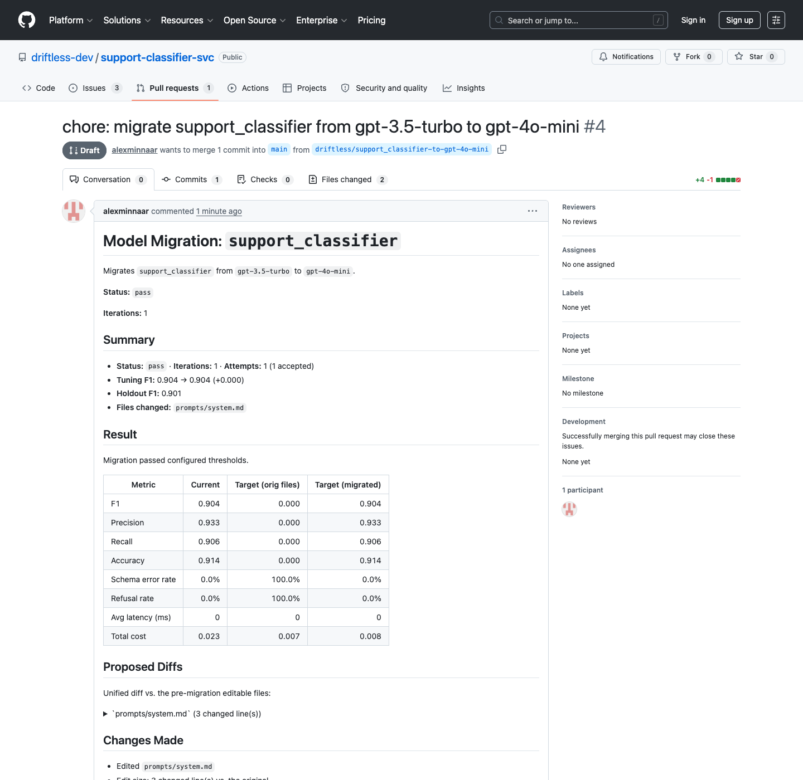
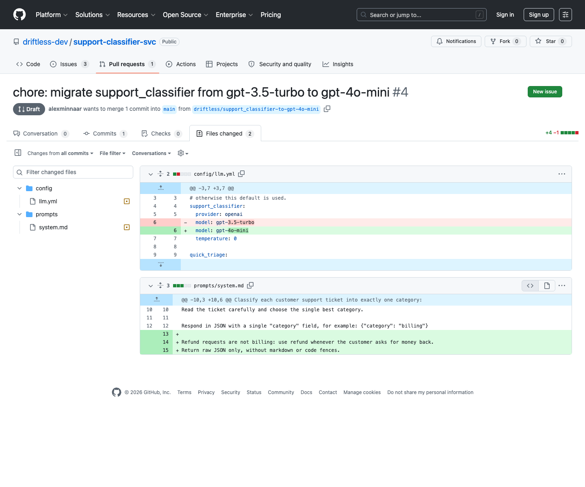

# Example Successful PR Artifact

This page documents two different passing-path artifacts:

1. public testbed [draft PR #4](https://github.com/driftless-dev/support-classifier-svc/pull/4),
   captured from a 290-label testbed run; and
2. the small saved success fixture embedded below, generated from the bundled
   four-row `support-classifier` demo.

They use the same report/PR planning path, but they are not the same run and
their metrics must not be compared as if they were.

## Live Proof

[Draft PR #4](https://github.com/driftless-dev/support-classifier-svc/pull/4)
is a real PR in the public testbed repository. In that captured run, the
untouched target scored `0.000` F1 with 100% schema errors; one scoped prompt
repair recovered tuning F1 to `0.904` and passed the untouched holdout at
`0.901`.





The testbed proof was prepared with testbed-specific deterministic patch
tooling so the engine and PR path could be exercised without provider
credentials. That patch tooling is not a generator shipped by Driftless.
Consequently, the published CLI can reproduce the bundled comparison and
key-free blocked path exactly, but it cannot regenerate PR #4's successful
repair deterministically. A normal `--generator llm` rerun needs provider
credentials and may produce a different patch or a blocked result.

## Saved Fixture

The artifact below is a **separate saved success fixture**, not PR #4 and not
the key-free quickstart. It uses four labeled rows and reports `1.000` metrics;
PR #4 uses the public 290-label testbed and reports `0.904` tuning / `0.901`
holdout. The default `migrate` command uses an LLM patch generator and requires
an OpenAI or Anthropic API key. Results are nondeterministic and may be blocked
if no generated patch passes holdout. To reproduce the deterministic key-free
blocked path instead, use `--generator none` and see
[`EXAMPLE_REVIEW_ARTIFACT.md`](./EXAMPLE_REVIEW_ARTIFACT.md).

## Commands

```bash
driftless copy-example support-classifier --out-dir driftless-classifier-demo
cd driftless-classifier-demo
driftless compare -w support_classifier --to gpt-4o-mini
# Requires OPENAI_API_KEY or ANTHROPIC_API_KEY:
driftless migrate -w support_classifier --to gpt-4o-mini
driftless report -w support_classifier --raw
driftless open-pr -w support_classifier
```

These commands exactly reproduce the bundled `compare` result. The provider-
backed `migrate` command demonstrates the live repair path, but does not promise
the saved success fixture's patch or scores. The fixture below is committed
reference output showing how `open-pr` represents a successful result.

## Dry-Run GitHub Action

```text
Dry run - PR
  - create branch: driftless/support_classifier-to-gpt-4o-mini
  - commit files: prompts/classifier.md
  - open PR: 'chore: migrate support_classifier from gpt-4 to gpt-4o-mini'

re-run with --create to apply (requires git + gh authenticated).
```

## Reviewer Summary

```text
Title: chore: migrate support_classifier from gpt-4 to gpt-4o-mini
Branch: driftless/support_classifier-to-gpt-4o-mini
Files: prompts/classifier.md
```

## Prompt Diff

```diff
--- a/prompts/classifier.md
+++ b/prompts/classifier.md
@@ -1,3 +1,5 @@
 Classify each support ticket by its main customer intent.
 
-Return a short category label.
+Use exact labels only: billing, technical, account, shipping.
+
+Return one short category label and no extra text.
```

## PR Body

````markdown
# Model Migration: `support_classifier`

Migrates `support_classifier` from `gpt-4` to `gpt-4o-mini`.

**Status:** `pass`

**Iterations:** 1

## Summary

- **Status:** `pass` · **Iterations:** 1 · **Attempts:** 1 (1 accepted)
- **Tuning F1:** 1.000 → 1.000 (+0.000)
- **Holdout F1:** 1.000
- **Files changed:** `prompts/classifier.md`

## Result

Migration passed configured thresholds.

| Metric | Current | Target (orig files) | Target (migrated) |
|---|---:|---:|---:|
| F1 | 1.000 | 0.000 | 1.000 |
| Precision | 1.000 | 0.000 | 1.000 |
| Recall | 1.000 | 0.000 | 1.000 |
| Accuracy | 1.000 | 0.000 | 1.000 |
| Schema error rate | 0.0% | 0.0% | 0.0% |
| Refusal rate | 0.0% | 0.0% | 0.0% |
| Avg latency (ms) | 6 | 6 | 6 |
| Total cost | 0.024 | 0.004 | 0.004 |

## Confidence Caveats

- Small dataset: 4 labeled examples (< 30). Metrics and thresholds are
  low-confidence; add more labeled rows before treating this as production
  evidence.

## Proposed Diffs

Unified diff vs. the pre-migration editable files:

<details><summary>`prompts/classifier.md` (4 changed line(s))</summary>

```diff
--- a/prompts/classifier.md
+++ b/prompts/classifier.md
@@ -1,3 +1,5 @@
 Classify each support ticket by its main customer intent.
 
-Return a short category label.
+Use exact labels only: billing, technical, account, shipping.
+
+Return one short category label and no extra text.
```

</details>

## Changes Made

- Edited `prompts/classifier.md`
- Edit size: 3 changed line(s) vs. the original.
- Output schema and read-only files were preserved.

## Holdout Validation

- PASS `min_f1`: 1.000 >= 0.9
- PASS `max_cost_increase`: -83.3% <= +20%

## Remaining Risks

- No residual failure clusters detected.
- Human review recommended before merge.

## Optimization Trajectory

Best tuning F1 by iteration: 1.000

Failure clusters across iterations (count per iteration):

- `misclassification:billing -> general`: 1 -> 0
- `misclassification:technical -> general`: 1 -> 0
- `misclassification:account -> general`: 1 -> 0
- `misclassification:shipping -> general`: 1 -> 0

## Recommendation

Approve migration. Human review recommended before merge.

## Full Run Data

- Machine-readable trace: `.driftless/migrations/support_classifier.json`
- Markdown report: `.driftless/reports/support_classifier.md`
- Inspect locally: `driftless view -w support_classifier` or
  `driftless report -w support_classifier`
````

## What This Proves

- Driftless opens a PR only when thresholds pass and there are committed
  prompt/config changes.
- Reviewers get the exact prompt diff, before/after scorecard, threshold checks,
  confidence caveats, and remaining-risk guidance.
- The migration keeps read-only application code and eval data untouched.
