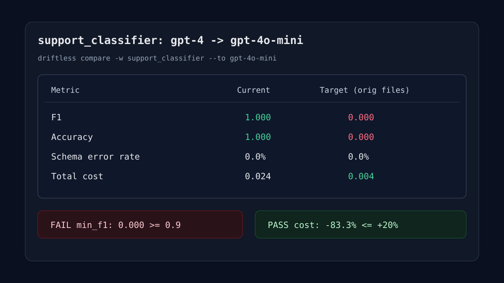
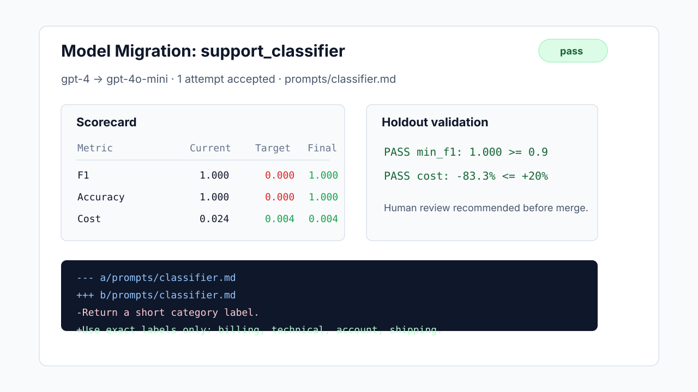
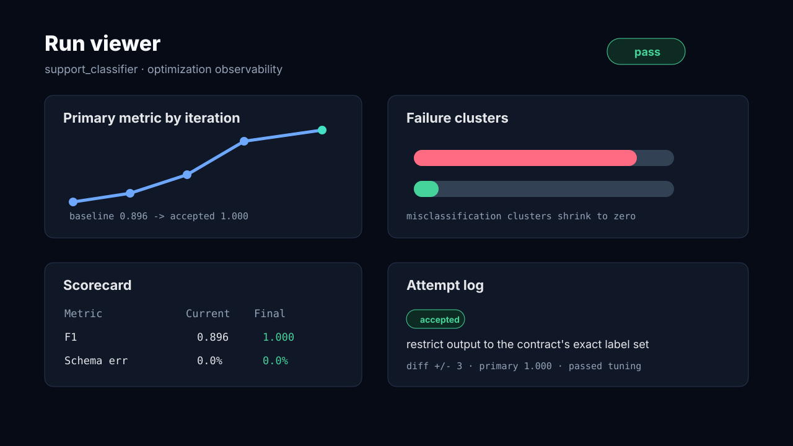

# Visual Proof Plan

Status: visual excerpts checked in; actual screenshots still need a
browser-capable environment.

Use this before publishing README images or blog posts externally. The current
Markdown fixtures are enough for reviewers to inspect the product surfaces, but
not enough for public launch visuals.

## Current Substitutes

| Surface | Current artifact |
|---|---|
| Compare scorecard | [`docs/visuals/compare-scorecard.svg`](./visuals/compare-scorecard.svg) plus [`docs/LAUNCH_CHECK.md`](./LAUNCH_CHECK.md). |
| Blocked report / issue body | [`docs/EXAMPLE_REVIEW_ARTIFACT.md`](./EXAMPLE_REVIEW_ARTIFACT.md) captures the blocked issue path. |
| Successful PR body | [`docs/visuals/successful-pr-artifact.svg`](./visuals/successful-pr-artifact.svg) plus [`docs/EXAMPLE_SUCCESS_PR.md`](./EXAMPLE_SUCCESS_PR.md). |
| Run viewer | [`docs/visuals/run-viewer-excerpt.svg`](./visuals/run-viewer-excerpt.svg) plus `site/runs.html#sample`. |

## Visual Excerpts

These are checked-in SVG excerpts derived from the fixtures. They are suitable
for README/blog drafts and product review, but should be replaced with true
browser screenshots before a public launch announcement.







## Screenshots To Capture

### 1. Compare Scorecard

Command:

```bash
cd examples/support-classifier
env PYTHONPATH=../../src ../../.venv/bin/python -m driftless.cli compare -w support_classifier --to gpt-4o-mini
```

Capture:

- Terminal window showing the scorecard table.
- Keep `F1 1.000 -> 0.000`, `Total cost 0.024 -> 0.004`, and `FAIL min_f1`
  visible.

Use in:

- README quickstart.
- Blog post 1.
- Blog post 3.

### 2. Markdown Report / PR Body

Capture:

- Render [`docs/EXAMPLE_SUCCESS_PR.md`](./EXAMPLE_SUCCESS_PR.md).
- Crop around the `Result`, `Proposed Diffs`, and `Holdout Validation`
  sections.

Use in:

- README evidence section.
- Blog post 1.
- Blog post 3.

### 3. Run Viewer

Command:

```bash
cd site
python3 -m http.server 8787
```

Open:

```text
http://127.0.0.1:8787/runs.html#sample
```

Capture:

- Top summary card with status.
- Primary metric chart.
- Failure-cluster chart.
- Scorecard and attempt log.

Use in:

- Blog post 6.
- Blog post 7.
- Blog post 8.

### 4. GitHub PR / Issue Body

Capture after a dry-run or testbed run:

- PR body from [`docs/EXAMPLE_SUCCESS_PR.md`](./EXAMPLE_SUCCESS_PR.md), once
  posted to GitHub or rendered in a GitHub-flavored Markdown preview.
- Issue body from [`docs/EXAMPLE_REVIEW_ARTIFACT.md`](./EXAMPLE_REVIEW_ARTIFACT.md).

Use in:

- README documentation section.
- Blog post 3.
- Blog post 4.

## Acceptance Criteria

- Scorecard screenshot from `compare`.
- Migration/report screenshot or markdown-rendered excerpt.
- Run viewer screenshot.
- GitHub PR/issue body screenshot from a dry-run or testbed run.
- Blog posts 1, 3, 7, and 8 each link to or include at least one relevant
  visual.
