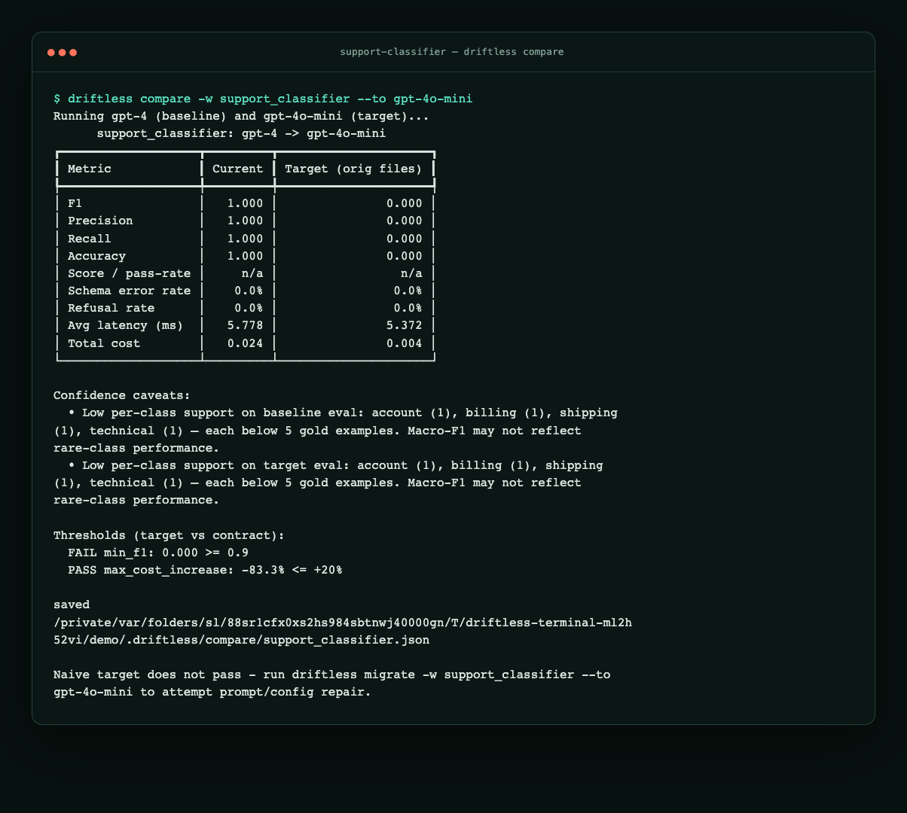

# Your ticket classifier’s model got deprecated

## What problem are we solving?

Imagine a support product that sends every incoming ticket to a large language
model (LLM) before a person sees it. The model must return a small JSON object,
such as `{"category": "billing"}`. A strict parser rejects markdown fences and
extra prose, then routes valid results to billing, technical, account, or refund.

The system has run on `gpt-3.5-turbo` for months. Its prompt and examples were
tuned for that model. When the provider deprecates it, changing one line in
`config/llm.yml` to `gpt-4o-mini` looks like a dependency update. Python unit
tests still pass, and a few staging examples look reasonable.

The risk is behavioral. A new model may wrap JSON in markdown, causing the parser
to record `null`, or interpret an unstated refund rule differently. The model ID
changed while the prompt did not. A **workflow contract** is the required
combination of harness command, output format, labels, allowed edits, cost
accounting, and release thresholds. A one-line model edit can break that contract.

This is **model-induced drift**, a change in workflow behavior caused by changing
the model. It can also expose **prompt drift**, where a prompt tuned for the old
model no longer produces the required behavior.

## What Driftless does

An **evaluation**, or **eval**, is a repeatable test of model behavior. An
**evaluation harness** is the command and code that run examples, parse outputs,
and calculate scores. Driftless runs your harness twice: once with the current
model, called the **baseline**, and once with the proposed model, called the
**candidate**.

Driftless then:

1. `compare`s baseline and candidate under the same harness and current files.
2. `migrate`s by asking a **repair generator**—the model or mechanism that
   proposes prompt changes—to edit only files allowed by `driftless.yml`.
3. Tests the best repair on a **holdout**, evaluation rows hidden from repair and
   candidate selection, to reduce overfitting to known examples.
4. Uses `report` to turn saved evidence into a reviewable summary.
5. Uses `open-pr` to preview or create a pull request when gates pass, or
   preserves blocked evidence in an issue when they do not.

Driftless orchestrates this loop. Your harness, parser, and scoring logic remain
the source of truth.

If you remember one rule, use this one: **run the candidate under the same
harness before merging a model change.**

## Before you start

This post uses two different fixtures:

- The bundled four-row demo is deterministic and key-free. It teaches the
  command flow, not provider quality or statistical confidence.
- The separate
  [support-classifier-svc](https://github.com/driftless-dev/support-classifier-svc)
  testbed has 290 labeled tickets, LiteLLM, and simulator plus live-API paths.

The testbed's parser deliberately does not rescue markdown-fenced output. That
strictness makes an output-shape change visible as an evaluation failure instead
of hiding a production parsing bug.

Before any repair, audit the labels. A label audit checks whether duplicate or
near-duplicate examples have contradictory expected answers. Prompt repair
cannot fix an evaluation set that defines “correct” inconsistently. Follow
[post 5](./05-audit-labels-before-you-trust-f1.md) first.

### Repair reproduction boundary

The historical passing pull request #4 is a 290-label testbed artifact. The
published CLI reproduces a passing four-row repair with `--generator fixture`.
Regenerating PR #4's exact patch still needs provider-backed `--generator llm`
(or the testbed's own simulator) and may differ.

[`EXAMPLE_SUCCESS_PR.md`](../EXAMPLE_SUCCESS_PR.md) keeps that 290-label testbed
result—`0.904` tuning and `0.901` holdout—separate from the bundled four-row
saved fixture, whose metrics are `1.000`.

## Walkthrough

### 1. Learn the flow with the bundled demo

The following commands install Driftless, copy its four-row classifier, validate
the workflow contract, and compare the configured baseline with `gpt-4o-mini`:

```bash
pip install driftless
driftless copy-example support-classifier --out-dir driftless-classifier-demo
cd driftless-classifier-demo
driftless validate -w support_classifier
driftless compare -w support_classifier --to gpt-4o-mini
```

Expect **macro-F1** to fall from `1.000` to `0.000` while cost falls from `0.024`
to `0.004`. Macro-F1 averages each category's F1 score without weighting by
category size; F1 balances precision and recall. This result proves that compare
and the quality gate work. It does not estimate either provider model's quality.
Current CLI output may also include average-latency rows and a
**Confidence caveats** section. On a four-row fixture, those warnings emphasize
that the sample is too small for a reliable production migration decision; they
do not contradict the deterministic demo result.

You can continue key-free with `migrate ... --generator none`, which records an
intentional `BLOCKED` result because no repair is attempted. On the bundled
demo, `migrate ... --generator fixture` records a passing repair without
provider credentials. On a real workflow, `--generator llm` needs credentials
and is nondeterministic.



### 2. Reproduce the regression in the 290-row testbed

The next commands clone and install the external testbed, restore the hand-written
prompt used before repair, enable its deterministic simulator, and compare the
same two models:

```bash
git clone https://github.com/driftless-dev/support-classifier-svc
cd support-classifier-svc
pip install -r requirements.txt driftless

cp evals/fixtures/prompt-baseline-scenario3.md prompts/system.md

export SUPPORT_CLASSIFIER_SIMULATE=1   # deterministic simulator, no API key
driftless compare -w support_classifier --to gpt-4o-mini
```

The baseline prompt says to respond in JSON, but it does not say “raw JSON only”:

```markdown
- billing: questions about invoices, charges, payments, or subscriptions
- refund: the customer wants their money returned
...
Respond in JSON with a single "category" field, for example: {"category": "billing"}
```

In a simulator run from July 2026, expect this saved CLI evidence:

```text
Running gpt-3.5-turbo (baseline) and gpt-4o-mini (target)...

┏━━━━━━━━━━━━━━━━━━━┳━━━━━━━━━┳━━━━━━━━━━━━━━━━━━━━━┓
┃ Metric            ┃ Current ┃ Target (orig files) ┃
┡━━━━━━━━━━━━━━━━━━━╇━━━━━━━━━╇━━━━━━━━━━━━━━━━━━━━━┩
│ F1                │   0.903 │               0.000 │
│ Schema error rate │    0.0% │              100.0% │
│ Total cost        │   0.033 │               0.011 │
└───────────────────┴─────────┴─────────────────────┘

Thresholds (target vs contract):
  FAIL min_f1: 0.000 >= 0.9
  FAIL max_schema_error_rate: 1.000 <= 0.02

Naive target does not pass - run driftless migrate ...
```

**Schema error rate** is the fraction of outputs that fail the configured output
format or parser contract. Here every simulated candidate output is fenced JSON,
so the strict parser rejects all of them and F1 falls to zero. The current model
passes; the unmodified candidate fails both release thresholds.

Do not treat these simulator numbers as a provider benchmark. They are an
adversarial production-contract test. The live comparison later shows the more
common problem: no schema explosion, but a quality drop after a prompt has become
coupled to its old model.

### 3. Describe the workflow once

The committed `driftless.yml` connects the harness, model override, evaluation
data, editable files, and release gates. This abbreviated configuration shows
the important relationships:

```yaml
workflows:
  support_classifier:
    run:
      command: python evals/run_eval.py
      input_path: evals/tickets.inputs.jsonl
      output_path: evals/outputs.jsonl
    model:
      current: gpt-3.5-turbo
      target_candidates: [gpt-4o-mini]
      env_var: SUPPORT_CLASSIFIER_MODEL
      config_file: config/llm.yml
      config_path: support_classifier.model
    files:
      editable: [prompts/system.md, prompts/examples.yml]
    eval:
      labels_path: evals/tickets.labels.jsonl
      label_field: category
      cost_field: cost_usd          # per-record cost for plan/compare
    thresholds:
      min_f1: 0.90
      max_schema_error_rate: 0.02
    migration:
      holdout_required: true
      max_iterations: 6
```

Driftless runs `python evals/run_eval.py` with
`SUPPORT_CLASSIFIER_MODEL` set; it does not recreate the testbed's
post-processing. `cost_field` identifies the per-record cost value used by
`plan` and `compare`. `max_iterations` limits repair attempts, and
`holdout_required` makes unseen-row validation mandatory.

Before comparing or repairing, run validation. This checks the configuration and
performs one harness run:

```bash
driftless validate -w support_classifier
```

Expect either a valid contract and successful harness execution or a focused
configuration/runtime error. Fix those errors before interpreting model scores.

### 4. Use compare as the pre-flight check

`compare` answers one narrow question: does the candidate pass today's contract
with today's prompt? It does not edit files. It saves JSON at
`.driftless/compare/support_classifier.json`, which later `report` and
`open-pr` commands can use.

Interpret the outcome this way:

- If the candidate passes all thresholds, it may be shippable as-is; review the
  evidence and use `open-pr`.
- If it fails and prompt changes could address the failures, use `migrate`.
- If repaired tuning results pass but holdout still fails, do not merge. Preserve
  the evidence in an issue and investigate.

### 5. Migrate, then prepare review evidence

The first command path below keeps classifier calls on the simulator while using
an LLM repair generator. The second uses live provider calls end to end. Both
require repair-generator credentials. The final command creates a pull request:

```bash
# Simulator harness, but LLM repair still needs generator credentials:
export OPENAI_API_KEY=...
SUPPORT_CLASSIFIER_SIMULATE=1 driftless migrate -w support_classifier \
  --to gpt-4o-mini --generator llm

# Real end-to-end (what the testbed's "Migrate model" Action does):
export OPENAI_API_KEY=...
driftless migrate -w support_classifier --to gpt-4o-mini --generator llm
driftless open-pr -w support_classifier --create
```

Expect `migrate` to propose changes only to `prompts/system.md` and
`prompts/examples.yml`, evaluate attempts, and apply the holdout gate. Expect
`open-pr --create` to include the scorecard, file diffs, and attempt log only
when the result is eligible. If holdout F1 cannot reach `min_f1: 0.90`, a blocked
result is correct; Driftless opens an issue with evidence instead of presenting a
false-confidence pull request.

`SUPPORT_CLASSIFIER_SIMULATE=1` replaces calls made by the classifier harness.
It does not supply the separate LLM repair generator. Use `--generator none` for
a fully key-free no-repair check, and expect it to remain blocked.

The testbed's
[migration workflow](https://github.com/driftless-dev/support-classifier-svc/blob/main/.github/workflows/migrate-on-model-change.yml)
restores the baseline prompt fixture, runs `audit-labels`, `compare`,
`migrate --strict-label-audit`, then `open-pr --create`.
`--strict-label-audit` stops repair when label problems make the target unsafe.

## How to interpret the results

Passing means more than “the model answered.” The candidate must satisfy the
same parser, labels, cost accounting, and release gate as production.

The simulator intentionally exaggerates fenced-JSON failures so CI can prove the
workflow without keys. With the same hand-written prompt on live
`gpt-3.5-turbo` and `gpt-4o-mini`, macro-F1 is about `0.92` for both. The larger
regression appears after optimization has coupled a prompt to the old model.

Label evidence clearly as simulator or live API. Simulation proves orchestration
and contract-failure handling; live runs test provider behavior.

## Deeper methodology: separate prompt debt from migration gain

**Prompt debt** is quality left unrealized because existing instructions or
examples are weak. To avoid claiming prompt cleanup as a migration benefit, the
testbed evaluates three prompts under both models on all 290 labels:

| Prompt | `gpt-3.5-turbo` | `gpt-4o-mini` |
|--------|-----------------|---------------|
| **P0** — original hand prompt | 0.922 | 0.904 |
| **P_src\*** — optimized on source | 0.993 | 0.921 |
| **P_tgt\*** — optimized on target | 1.000 | 0.987 |

`P0` is the original hand-written prompt. `P_src*` was optimized while the source
model stayed pinned. `P_tgt*` was optimized while the target stayed pinned.
Evaluating every prompt under both models separates prompt debt from
model-induced drift:

- `0.922 → 0.993` on the source is mostly prompt debt.
- `0.993 → 0.921` after the swap is model-induced drift.
- `0.921 → 0.987` after target repair is the migration gain to report.

See [Measuring migration gains honestly](../repair-and-generators.md#measuring-migration-gains-honestly)
for the full method.

## What happens when it fails?

Failure is a safety result, not an incomplete run:

- Contract or harness errors mean the test setup must be fixed before scores are
  meaningful.
- Label-audit failures mean labels must be corrected before repair.
- Candidate threshold failures mean the model swap must not be merged as-is.
- Holdout failure means a repair worked on rows it saw but did not generalize
  well enough to release.
- Missing repair credentials prevent `--generator llm`; they do not justify
  bypassing the gate.

The lifecycle catalog marks `gpt-3.5-turbo` deprecated, with a retirement date
in the past as of 2026. Both `support_classifier` and `quick_triage` still use
it. To ask `plan` which workflows need action, run the following with the
testbed simulator:

```bash
SUPPORT_CLASSIFIER_SIMULATE=1 driftless plan
```

Expect the two workflows to be grouped under one
`gpt-3.5-turbo → gpt-4o-mini` deprecation move, each with a regressing naive
comparison and an `ISSUE (critical)` decision. The saved evidence elsewhere in
this repository was captured 277 days after retirement, so current CLI columns
are represented as follows:

```text
┃ Workflow           ┃ Trigger     ┃ Migrate                       ┃ Retires ┃ Naive     ┃ Decision         ┃
│ support_classifier │ deprecation │ gpt-3.5-turbo -> gpt-4o-mini │ -277d   │ regresses │ ISSUE (critical) │
│ quick_triage       │ deprecation │ gpt-3.5-turbo -> gpt-4o-mini │ -277d   │ regresses │ ISSUE (critical) │

2 workflow(s) need action across 1 model move(s):
  gpt-3.5-turbo -> gpt-4o-mini (deprecation): support_classifier, quick_triage
```

`Retires` is the number of days until retirement, so a negative value means the
date has passed. `Naive` summarizes the unchanged-prompt comparison. `plan`
discovers and groups work; it does not replace `compare` or perform repair.
[Post 3](./03-dependabot-for-prompts-in-ci.md) explains the CI flow.

## Next steps

- If labels move while the model stays fixed, continue to
  [post 2 and `refine`](./02-when-labels-move-refine-not-remodel.md).
- To schedule lifecycle checks in GitHub Actions, read
  [post 3 on `init-ci` and `plan`](./03-dependabot-for-prompts-in-ci.md).
- To run the testbed workflow, open
  [support-classifier-svc](https://github.com/driftless-dev/support-classifier-svc)
  and choose Actions → **Migrate model**.
