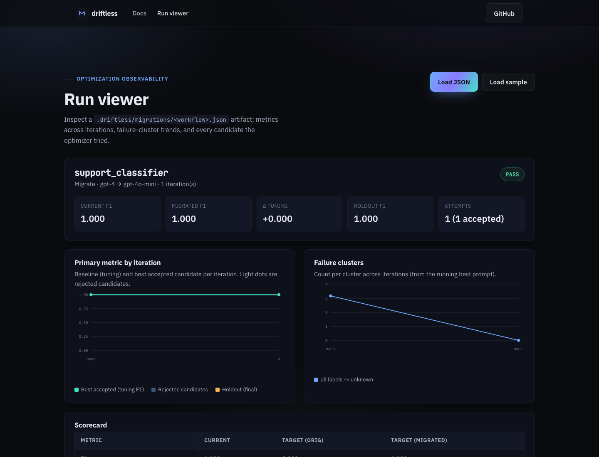

# Tool-calling support agent: new planner, same tools

**Specialized fixture · 4 rows · key-free:** this guide uses the deterministic
`tool-agent` example installed by `copy-example`. It is not the bundled
classifier or the separate 290-row external testbed.

## The problem: a good final sentence can hide a bad action

A tool-calling support agent can look up an order, check a refund policy, issue a
refund, send an invoice, or reset a password. A **tool call** is the agent's
structured request to run one of those operations. The **planner** is the part
of the agent, often a language model guided by a prompt, that decides which
tools to call and in what order.

For a refund, a safe plan is:

1. look up the order;
2. check whether policy allows a refund;
3. issue the refund only when eligible;
4. explain the result.

Now replace the planner model with a cheaper candidate. It may produce a polite
answer saying "I issued your refund" while skipping the lookup and policy check.
Reading only the final answer misses the unsafe behavior.

A **trace** is the recorded sequence of steps taken by the agent, including tool
names, errors, and the final answer. Agent migration needs trace evidence so you
can distinguish a planning failure from a tool failure or a wording problem.

Driftless runs the full application under the candidate model, scores both
behavior and trace, and limits repair to the planner and tool-description files
allowed by the contract.

## Mental model: score actions before prose

Each fixture result includes the final answer and the ordered tools:

```jsonl
{"id":"a001","final":"Refund issued for ord-1001...","tools":["lookup_order","check_policy","refund_payment"],"tool_errors":[],"score":1.0,"cost":0.024}
```

The `cost: 0.024` value belongs to this one output row. The compare table later
reports total cost summed across all four fixture rows, so the baseline total is
`4 × 0.024 = 0.096`.

A **side effect** is a change outside the evaluation process, such as sending an
email, issuing money, or changing an account. The fixture uses **fake tools**:
local Python functions over test data that imitate those operations without
performing them. A **sandbox tool** runs in an isolated environment where its
effects cannot reach production systems.

The evaluator gives a row `0.0` if a tool error exists or the ordered tool list
does not exactly match the expected list. If the trace is correct, it scores how
many required terms appear in the final answer. The result can therefore range
from `0.0` to `1.0`, although this bundled regression produces `1.0` for
baseline rows and `0.0` for uncorrected target rows.

The contract setting **`score_field`** tells Driftless which output property
contains the numeric quality score. Driftless averages it into
**Score / pass-rate** and compares that mean with `min_score`. The score is an
application-defined measurement, not a probability.

A **holdout** is a subset of cases kept away from prompt repair until final
validation. The fixture uses a 60% tuning and 40% holdout split. With only four
rows, it demonstrates the workflow but does not provide production-level
confidence.

## Before you start

You need Python and a shell. This fixture is local, deterministic, and
side-effect-free. It requires no model-provider credentials.

The copied project contains:

- `driftless.yml`: workflow contract;
- `python3 -m app.eval_agent`: evaluation command;
- `data/orders.jsonl` and `data/policies.json`: fake tool data;
- `evals/cases.jsonl` and `evals/gold.jsonl`: requests and expected traces;
- `prompts/planner.md` and `prompts/tool_descriptions.md`: editable prompts.

Its tools are plain Python functions named `lookup_order`, `check_policy`,
`refund_payment`, `send_invoice`, and `reset_password`. No real refund, email,
password reset, or account change occurs.

A **repair generator** proposes prompt or configuration changes from failures.
The normal LLM repair generator requires provider credentials and makes
nondeterministic model calls. The complete key-free path below disables it.

## Walkthrough

### 1. Install Driftless and copy the fixture

These commands install the published package, create a standalone agent demo,
and enter its directory:

```bash
pip install driftless
driftless copy-example tool-agent --out-dir driftless-agent-demo
cd driftless-agent-demo
```

Expect a local four-row project with fake tool data and no external calls.

### 2. Validate the current workflow

Run the configured current planner behavior:

```bash
driftless validate -w support_agent
```

Expect Driftless to execute `python3 -m app.eval_agent`, read the output JSONL,
and validate the metrics and schema. Model names select deterministic fixture
behavior rather than calling hosted models.

### 3. Compare current and candidate planners

This command evaluates the same cases and fake tools for `gpt-4` and the
simulated `gpt-4o-mini` target:

```bash
driftless compare -w support_agent --to gpt-4o-mini
```

Expect this actual fixture output:

```text
Running gpt-4 (baseline) and gpt-4o-mini (target)...

┏━━━━━━━━━━━━━━━━━━━┳━━━━━━━━━┳━━━━━━━━━━━━━━━━━━━━━┓
┃ Metric            ┃ Current ┃ Target (orig files) ┃
┡━━━━━━━━━━━━━━━━━━━╇━━━━━━━━━╇━━━━━━━━━━━━━━━━━━━━━┩
│ F1                │     n/a │                 n/a │
│ Precision         │     n/a │                 n/a │
│ Recall            │     n/a │                 n/a │
│ Accuracy          │     n/a │                 n/a │
│ Score / pass-rate │   1.000 │               0.000 │
│ Schema error rate │    0.0% │                0.0% │
│ Refusal rate      │    0.0% │                0.0% │
│ Total cost        │   0.096 │               0.024 │
└───────────────────┴─────────┴─────────────────────┘

Thresholds (target vs contract):
  FAIL min_score: 0.000 >= 0.85
  PASS max_cost_increase: -75.0% <= +20%
```

Current CLI versions may also print confidence caveats and average latency rows
for this four-row smoke fixture. Those extra lines are expected; they do not
change the score and cost results shown above.

The target is 75% cheaper in the fixture, but its mean quality score is `0.000`.
The contract requires at least `0.850`. The candidate fails because it does not
follow the tool protocol.

### 4. Run the complete key-free blocked path

This command evaluates migration behavior but disables prompt proposals:

```bash
driftless migrate -w support_agent --to gpt-4o-mini --generator none
```

`--generator none` means no repair generator is available. The unchanged target
fails `min_score`, and Driftless has no candidate planner or tool-description
edit to test. Expect a non-zero exit with `BLOCKED`; no repair is attempted. The
failed migration result is still saved.

Render the saved evidence:

```bash
driftless report -w support_agent
```

Expect the report to show the score, trace-related failures, remaining failure
groups, and holdout information when that stage was reached.

Preview what Driftless would deliver:

```bash
driftless open-pr -w support_agent
```

This is a dry run because `--create` is absent, so it does not touch GitHub. A
blocked result has no shippable prompt change. Driftless therefore previews an
**issue** describing the blocker rather than a pull request that implies the
migration is ready.

A passing repair on this bundled example is also available key-free with
`--generator fixture`. `--generator llm` is refused here because the harness
does not call a model; use `copy-example support-classifier-live` or a
customer harness for live repair. Review the resulting trace evidence before
previewing or creating a pull request.



The report and delivery evidence shape is also shown in
[`EXAMPLE_SUCCESS_PR.md`](../EXAMPLE_SUCCESS_PR.md). See the
[repair reproduction boundary](./01-model-swap-is-not-a-migration.md#repair-reproduction-boundary)
for the limits of reproduced repair output.

### 5. Understand the behavior a repair would encode

The fixture starts with an intentionally vague planner:

```markdown
Choose tools that seem directly related to the customer request.

For refunds, use the refund tool when the customer asks for money back. Keep the
answer short and helpful.
```

For the target to pass, the planner and tool descriptions need explicit
operational rules:

- call `lookup_order` before making a refund decision;
- call `check_policy` before `refund_payment`;
- call `refund_payment` only after eligibility is confirmed;
- include the tool trace in every result.

These are planner-prompt and tool-description changes, not tool implementation
changes.

## Advanced contract boundary

The contract limits what repair may edit:

```yaml
files:
  editable:
    - prompts/planner.md
    - prompts/tool_descriptions.md
  readonly:
    - app/
    - data/orders.jsonl
    - data/policies.json
    - evals/cases.jsonl
    - evals/gold.jsonl
```

Driftless can clarify instructions. It cannot edit the tool simulator, fixture
data, expected traces, or scoring rules.

The scoring, split, and cost gates are:

```yaml
eval:
  id_field: id
  score_field: score
  cost_field: cost
  split:
    tuning: 60%
    holdout: 40%

thresholds:
  min_score: 0.85
  max_cost_increase: 0.20
```

`max_cost_increase: 0.20` allows at most a 20% cost increase. The target's
negative increase is a cost reduction, so cost passes while quality fails.

Production trace records may also include tool arguments, returned values,
retrieved documents, retries, and timestamps. Avoid placing secrets or sensitive
payloads in reports.

## Interpret the result

`Score / pass-rate: 1.000` means the mean field selected by `score_field` is
`1.0`. In this fixture, that corresponds to exact expected tool sequences, no
tool errors, and all required final-answer terms. `0.000` means every target row
failed the evaluator. It does not mean the model was 0% likely to answer.

Inspect the trace before changing prompts. A missing lookup suggests planner or
tool-description drift. A correct tool sequence with a wrong final answer
suggests answer-generation drift. A tool exception may be an implementation or
fixture problem rather than a model problem.

## Safety and failure behavior

- Keep initial agent evaluations local or inside CI.
- Use fake or sandboxed tools for migration tests.
- Do not let a hosted runner execute arbitrary side-effecting tools without a
  sandbox and explicit authorization controls.
- Treat a blocked issue preview as evidence of a problem, not approval to run
  real actions.
- Keep tool implementations, fixtures, and scoring rules read-only during prompt
  repair.

Agent evaluation work grows with the number of cases, planner/tool steps, repair
candidates, and iterations. Holdout adds another target validation. If an LLM
judge scores outputs, add one judge call per output row per evaluation run.

Intuitively, more cases and longer traces increase each run, while candidates
and iterations repeat those runs:

\[
\text{work} \approx
\text{records} \times \text{model/tool steps}
\times \text{repair candidates} \times \text{iterations}
+ \text{holdout validation}
\]

## Next steps

- Read [RAG and agent contract details](../rag-and-agents.md).
- Add semantic scoring only after
  [judge calibration](./06-trust-your-llm-judge.md).
- Review [cost and budget guidance](../COST_AND_BUDGETS.md).
- [Automate only after local validation](./03-dependabot-for-prompts-in-ci.md).
